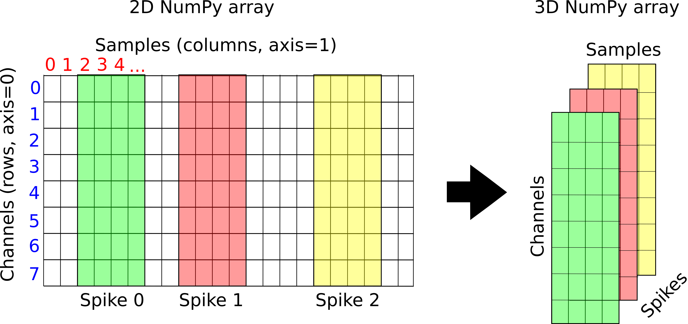

# Data Science and Analysis in Neuroscience

This is the repository for the course [Data Science and Analysis in Neuroscience]() which is offered to Masters students on the Neuroscience Major program at the  Faculty of Biosciences, University of Heidelberg.

The course is aimed at students interested to improve their ability to perform data analysis in the field of neuroscience. 

## Lecture 1

* What is data science?
* Introduction to Python, NumPy, Matplotlib
* Load electrophysiological data recorded from the hippocampus of a mouse into a NumPy array

## Lecture 2

* Why and how are in-vivo recordings performed?

* Detecting action potentials and spike clustering
  * Filtering
  * Detecting spikes
  * Extracting spike waveforms
  * Dimensionality reduction
  * Clustering spike waveforms

