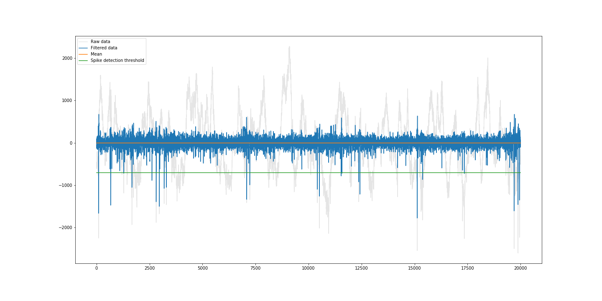
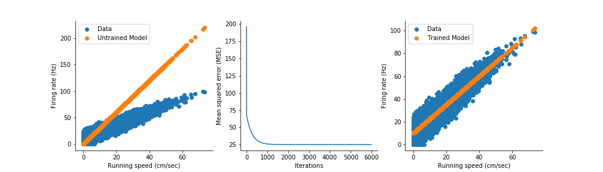
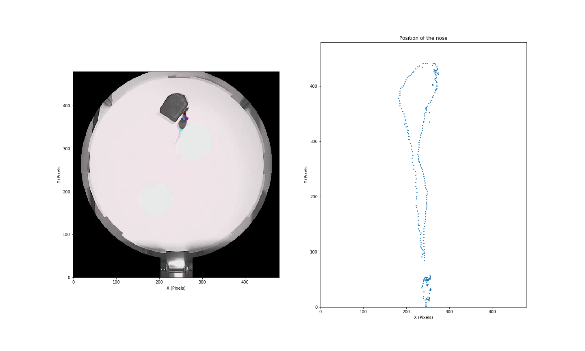

# Data Science in Neuroscience

This is the repository for the course `Data Science in Neuroscience` which is offered to Masters students on the Neuroscience Major program at the  Faculty of Biosciences, University of Heidelberg.

The course is aimed at students interested in improving their ability to perform data analysis in the field of neuroscience. 

## Lecture 1

* What is data science?
* Introduction to Python, NumPy, Matplotlib
* Load electrophysiological data recorded from the hippocampus of a mouse into a NumPy array

## Lecture 2

* Why and how are in-vivo recordings performed?

* Detecting action potentials and spike clustering
  * Filtering
  * Detecting spikes
  * Extracting spike waveforms
  * Dimensionality reduction
  * Clustering spike waveforms

## Lecture 3

* Detecting action potentials and spike clustering
  * Dimensionality reduction
  * Clustering spike waveforms
  

## Lecture 4

* Introduction to machine learning
* Speed cell: a simple example of machine learning with a linear regression

## Lecture 5

* Introduction to deep neuronal networks
* Pose estimation using Deeplabcut

## Lecture 6

* Analysis on spike trains (mean firing rate and instantaneous firing rate)
* Firing rate map of a spatially selective neuron

