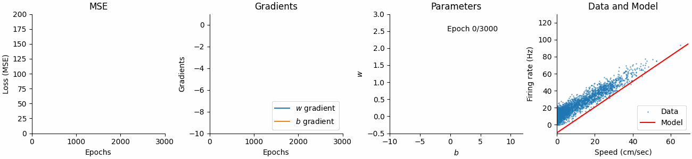

# Data Science in Neuroscience

This is the repository for the course [Data Science and analysis in Neuroscience](https://lsf.uni-heidelberg.de/qisserver/rds?state=verpublish&status=init&vmfile=no&moduleCall=webInfo&publishConfFile=webInfo&publishSubDir=veranstaltung&veranstaltung.veranstid=375092&purge=y&topitem=lectures&subitem=editlecture&asi=al$3tixanI2BKb.VkKa2) which is offered to Master's students on the Neuroscience Major program at the  Faculty of Biosciences, University of Heidelberg.

The course is aimed at students interested in improving their ability to perform data analysis in the field of neuroscience. 

There is a series of lectures that introduces the main concepts, and each lecture ends with some exercises that can be completed between lectures. 

There will be 2-3 quizzes to test how much of the course content has been learned and can be used in the context of typical problems encountered while performing data analysis.

The students will complete a small data science project at the end of the course.

## Week 1

* What is data science?
* Introduction to Python, NumPy, Matplotlib, and Pandas.

* Load electrophysiological data recorded from the hippocampus of a mouse into a NumPy array.
* Inspect NumPy arrays, perform calculations on NumPy arrays, and plot NumPy arrays with Matplotlib.

## Week 2

* Introduction to machine learning
* Speed cell: a simple example of machine learning with a linear regression

## Week 3

* Why and how are in-vivo recordings performed?

* Introduction to the SciPy library

* Detecting action potentials and spike clustering
  * Filtering
  * Detecting spikes
  * Extracting spike waveforms
  

## Week 4

Introduction to the scikit-learn library

* Dimensionality reduction

* Clustering spike waveforms
  

## Week 5

* Introduction to neural networks
* Training models with pytorch
* Using a convolutional network to classify images

## Lecture 6

* Analysis on spike trains (mean firing rate and instantaneous firing rate)
* Firing rate map of a spatially selective neuron

